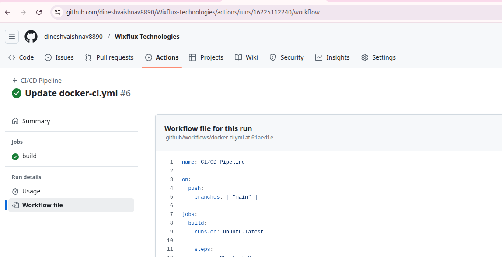

# 🌊 Wixflux-Docker

Welcome to **Wixflux-Docker** – a lightweight and responsive static website containerized with Docker, styled with CSS, and powered by GitHub Actions for seamless CI/CD.



---

## 📁 Project Structure

.
├── .github/workflows # CI/CD GitHub Actions configuration
│ └── main.yml
├── ScreenShoot # Project screenshots for README and documentation
├── imgea # Image assets used in the website
├── Dockerfile # Docker configuration to containerize the app
├── README.md # You're reading it!
├── index.html # Main HTML page
├── style.css # CSS styles for the webpage


---

## 🚀 Features

- 🐳 **Dockerized App**: Fully containerized for fast deployment
- 💅 **Responsive UI**: Styled with modern CSS for a clean and elegant look
- ⚙️ **GitHub Actions**: CI/CD pipeline for automated builds and deployments
- 📷 **Visual Docs**: Screenshot folder for visual documentation
- 🧩 **Modular Design**: Easy to update, extend, and maintain

---

## 📸 Screenshots

> A visual preview of the Wixflux static site

| Homepage |
|----------|
|  |

---

## 🛠️ Getting Started

### Prerequisites

- [Docker](https://www.docker.com/products/docker-desktop)
- [Git](https://git-scm.com/)

---

### 🔧 Installation & Run

```bash
# Clone the repository
git clone https://github.com/Dineshvaishnav8890/Wixflux-Docker.git
cd Wixflux-Docker

# Build the Docker image
docker build -t wixflux-app .

# Run the Docker container
docker run -d -p 80:80 wixflux-app


Open your browser and navigate to http://localhost:80


🧪 GitHub Actions
This project uses GitHub Actions for CI/CD.
Whenever code is pushed to the main branch, a workflow inside .github/workflows/main.yml is triggered to build and deploy the application.


⚙️ CI/CD with GitHub Actions + Docker Hub
You can automate the build and deployment of your Docker image to Docker Hub using GitHub Actions.

✅ Setup Steps
Create GitHub Secrets
Go to your repository → Settings → Secrets and variables → Actions → New repository secret

Add the following:

DOCKER_USERNAME – your Docker Hub username

DOCKER_PASSWORD – your Docker Hub password or access token

GitHub Actions Workflow File

Push to GitHub
Whenever you push changes to the main branch, GitHub Actions will:

Build the Docker image

Push it to Docker Hub as your-username/wixflux-app:latest


🐳 Pull & Run from Docker Hub
After successful CI/CD deployment, anyone can run the app like this:


docker pull your-docker-username/wixflux-app:latest
docker run -d -p 8080:80 your-docker-username/wixflux-app:latest
📡 Open your browser and navigate to http://localhost:80


